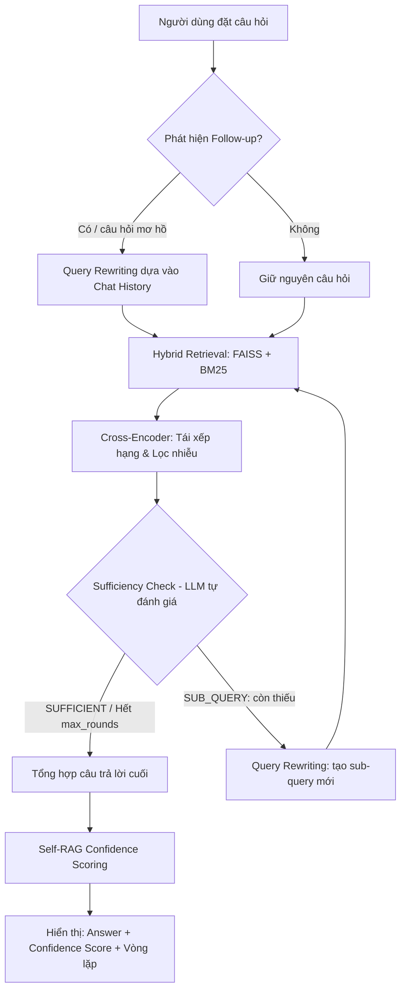

# Kiến trúc và Quy trình Hoạt động của Co-RAG (Advanced RAG)

Co-RAG (Chain-of-Retrieval Augmented Generation) là cơ chế suy luận đệ quy giúp SmartDoc AI vượt xa các hệ thống RAG thông thường. Tài liệu này mô tả chi tiết quy trình xử lý, các hàm chính và tên file tương ứng.

---

## 1. Sơ đồ Luồng hoạt động (Workflow Diagram)



---

## 2. Chi tiết Quy trình 5 Giai đoạn

### Giai đoạn 1: Chuẩn hóa & Thấu hiểu Ngữ cảnh (Conversational Memory)
- **Bắt đầu:** Hệ thống nhận câu hỏi từ UI (`streamlit_app.py`).
- **Xử lý:** Phát hiện xem câu hỏi có phải là follow-up không → nếu có, dùng Chat History để viết lại câu hỏi thành câu độc lập, đầy đủ nghĩa.
- **Kết quả:** Một câu hỏi đã được chuẩn hóa, sẵn sàng cho retrieval.
- **Số lần gọi LLM:** 0 hoặc 1 lần (chỉ khi cần rewrite).

> **Xem mục 3 để biết chi tiết các hàm của chức năng nhớ.**

### Giai đoạn 2: Truy xuất Đa tầng (Hybrid Retrieval)
Hệ thống sử dụng "lưới quét hai lớp" để lấy tài liệu:
1. **Lớp FAISS (Semantic):** Tìm các đoạn văn có ý nghĩa tương đồng ngay cả khi không trùng từ khóa.
2. **Lớp BM25 (Keyword):** Đảm bảo trúng đích các thuật ngữ kỹ thuật chính xác.

*Đặc biệt:* Nhờ **Manual Page Overlap (300 ký tự)** — được tạo bởi `_apply_manual_chunk_overlap()` trong `document_processing_pipeline.py` — mỗi đoạn văn bản lấy ra đều mang theo "ký ức" của đoạn trước đó, giúp mạch văn không bao giờ bị đứt đoạn.

### Giai đoạn 3: Tái xếp hạng Chuyên sâu (Cross-Encoder Re-ranking)
Đây là tầng "thẩm định viên":
- Toàn bộ các đoạn văn tiềm năng được đưa vào mô hình **Cross-Encoder** (`cross-encoder/ms-marco-MiniLM-L-6-v2`).
- Hệ thống chấm điểm tương quan thực tế giữa (Câu hỏi ↔ Đoạn văn) bằng hàm `rerank_docs()` trong `faiss_vector_store.py`.
- **Kết quả:** Chỉ giữ lại những đoạn văn có điểm số cao nhất, loại bỏ hoàn toàn các đoạn văn rác hoặc gây nhiễu cho AI.

### Giai đoạn 4: Suy luận Đệ quy (Self-RAG & Multi-hop)
Đây là "bộ não" của Co-RAG — **tối đa 2 vòng** (`max_rounds = 2`):
1. **Self-Assessment:** AI tự đọc tài liệu vừa tìm được và tự hỏi: "Thông tin này đã đủ trả lời câu hỏi chưa?" → gọi `_assess_sufficiency()` → **LLM call #1**.
2. **Query Rewriting:** Nếu thiếu, AI tạo một sub-query mới qua `_extract_subquery()`, sau đó retrieval lại lần 2.
3. **Tích lũy Context:** Kết quả mới được hợp nhất và lọc trùng bằng `_deduplicate_chunks()`.
4. **Điều kiện dừng sớm:** Hàm `_is_explicit_sufficient_signal()` trong `corag_chain_manager.py` kiểm tra SUFFICIENT hoặc heuristic 70% keyword → break sớm nếu đủ.

### Giai đoạn 5: Tổng hợp & Xác thực (Final Generation)
- **Hợp nhất:** Gom tất cả các mảnh ghép từ các vòng lặp vào `accumulated_context`.
- **Sinh đáp án:** `model_engine.generate()` → **LLM call #2** — viết câu trả lời cuối từ `build_corag_final_prompt()`.
- **Confidence Scoring:** `model_engine.self_rag_confidence_score()` → **LLM call #3** — chấm điểm 0–10 dựa trên bằng chứng tài liệu.

> **Tổng LLM calls/lượt:** RAG = 2 lần | Co-RAG = 3 lần (1 assess + 1 generate + 1 score)

---

## 3. Chức năng Nhớ Hội Thoại (Conversational Memory)

Đây là tầng **ngoài cùng** của pipeline, chạy trước khi retrieval bắt đầu.

### 3.1. Các hàm chính

| Hàm | File | Chức năng |
|---|---|---|
| `is_follow_up_query(query)` | `src/application/query_rewriter.py` | Phát hiện câu hỏi follow-up dựa vào từ chỉ thị ("nó", "vậy", "cái đó"...) |
| `should_include_history_in_prompt(query, used_rewrite)` | `src/application/query_rewriter.py` | Quyết định có đưa lịch sử vào Prompt hay không |
| `rewrite_query_with_history(query, chat_history, model_name)` | `src/application/query_rewriter.py` | Gọi LLM để viết lại câu follow-up thành câu độc lập, đầy đủ nghĩa |
| `build_chat_history_context(chat_history, max_turns=4)` | `src/application/prompt_engineering.py` | Format 4 lượt hội thoại gần nhất thành chuỗi text cho Prompt |
| `build_rag_prompt(..., chat_history)` | `src/application/prompt_engineering.py` | Tích hợp lịch sử vào RAG Prompt nếu `include_history=True` |
| `build_corag_final_prompt(..., chat_history)` | `src/application/prompt_engineering.py` | Tích hợp lịch sử vào Co-RAG Final Prompt |
| `_prune_stale_pending_entries(chat_history)` | `src/presentation/streamlit_app.py` | Dọn sạch các mục pending chưa hoàn thành trong lịch sử |
| `_extract_pending_qa_from_history(chat_history)` | `src/presentation/streamlit_app.py` | Phục hồi Q&A đang chờ khi app reload |

### 3.2. Luồng Memory Pipeline

```
User gõ câu hỏi mới
        ↓
is_follow_up_query()       ← Không gọi LLM, dùng pattern matching
        ↓ Nếu True
rewrite_query_with_history()  ← Gọi LLM (heuristic nếu LLM fail)
        ↓
build_chat_history_context()  ← Format tối đa 4 lượt lịch sử
        ↓ Nhúng vào Prompt
build_rag_prompt() / build_corag_final_prompt()
```

### 3.3. Cơ chế lưu trữ

- Chat history được lưu vào `st.session_state["chat_history"]` (in-memory Streamlit).
- Giới hạn **50 lượt gần nhất** (dòng `history_arr[:50]` trong `streamlit_app.py`).
- Đường dẫn thư mục lưu file: `CHAT_HISTORY_DIR = DATA_DIR / "chat_history"` (`src/config.py`).
- Khi tải phiên làm việc cũ: `st.session_state["chat_history"] = session.get("history", [])`.

---

## 4. Phân tích Chuyên sâu Công nghệ

### 4.1. Self-RAG (Cơ chế Tự kiểm chứng)
- **Hàm:** `_assess_sufficiency(question, accumulated_context)` trong `corag_chain_manager.py`.
- **Prompt:** `build_corag_sufficiency_check_prompt()` trong `prompt_engineering.py`.
- **Hoạt động:** Gửi ngữ cảnh tích lũy và câu hỏi đến LLM. Model trả về `SUFFICIENT` hoặc `SUB_QUERY: <câu hỏi bổ sung>`.
- **Tác dụng:** Loại bỏ lỗi "trả lời đại" khi tài liệu không có thông tin.

### 4.2. Query Rewriting (Viết lại truy vấn thông minh)
- **Hàm:** `_extract_subquery(assessment, fallback)` trong `corag_chain_manager.py`.
- **Cách làm:** Regex tách phần `SUB_QUERY:` ra khỏi câu trả lời LLM, biến nó thành Search Query tối ưu. Query mới được kết hợp với câu hỏi gốc (anchored query) để tránh lạc đề.
- **Tác dụng:** Thu hẹp phạm vi tìm kiếm vòng 2 vào đúng "mảnh ghép" còn thiếu.

### 4.3. Multi-hop Reasoning (Suy luận đa bước)
- **Hàm:** `_retrieve_and_format_chunks()` và `_deduplicate_chunks()` trong `corag_chain_manager.py`.
- **Hàm độc lập:** `multi_hop_retrieve()` trong `query_rewriter.py` — dùng cho retrieval 2 bước riêng biệt (hop1 → extract keywords → hop2).
- **Thuật toán Tích lũy:** Sau mỗi vòng, Context mới được cộng dồn vào Context cũ. `_deduplicate_chunks()` so sánh nội dung để đảm bảo AI không đọc lại thông tin trùng lặp.
- **Giới hạn:** `max_rounds = 2` → tối đa 2 vòng retrieval để tránh thời gian chờ quá dài (~4 phút với Qwen local).

### 4.4. Confidence Scoring (Chấm điểm tin cậy)
- **Hàm:** `model_engine.self_rag_confidence_score(query, answer, docs)` trong `ollama_inference_engine.py`.
- **Cách tính:** AI dựa trên 3 tiêu chí: Độ phủ thông tin (Coverage), Độ chính xác dẫn chứng (Citation Accuracy), Mức độ logic (Logic Flow).
- **Thang điểm:** 0–10. Điểm cao = thông tin chắc chắn, điểm thấp = chỉ mang tính tham khảo.

---

## 5. So sánh Basic RAG vs Co-RAG

| Tiêu chí | Basic RAG | Co-RAG |
|---|---|---|
| **Số lần gọi LLM** | 2 lần (generate + score) | 3 lần (assess + generate + score) |
| **Thời gian chạy** | ~2 phút (Qwen local) | ~2–4 phút (Qwen local) |
| **Chất lượng khi thiếu context** | Dễ sinh ảo giác (Hallucination) | Tự nhận diện thiếu sót, đi tìm thêm |
| **Độ tin cậy** | Không rõ ràng (Black-box) | Có Confidence Score 0–10 và log từng vòng |
| **Phù hợp với** | Câu hỏi đơn giản, 1 tài liệu | Câu hỏi phức tạp, nhiều tài liệu, đa bước |

---

## 6. Kết luận

Kiến trúc Co-RAG của SmartDoc AI không chỉ đơn thuần là tìm kiếm-trả lời, mà là một **Hệ chuyên gia** có khả năng tự nhận thức về giới hạn kiến thức của mình và chủ động đi tìm lời giải cho đến khi đạt được độ tin cậy tối ưu.

_TL;DR: Cơ chế này giả lập cách tư duy của 1 thủ thư đi tìm tài liệu. Thay vì chỉ tìm từ khóa theo yêu cầu 1 lần báo cáo lại, nó sẽ lấy kết quả ra đọc lại, thấy chưa liên kết hoặc đứt gãy → viết cái ghi chú (Subquery) → đi tìm lại trong tủ sách lần nữa cho đủ._
